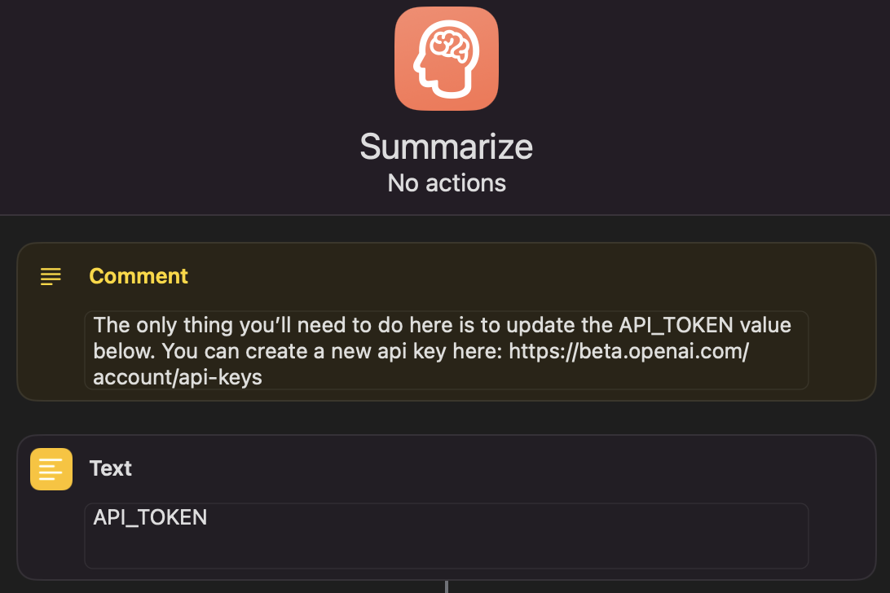

# Summarize - Apple Shortcut Open AI

Apple shortcut to quickly and easily summarize the content of images or texts.

Demo: https://www.youtube.com/shorts/lPM0GsUeLGY 

> 
> 🚨  
> Do not blindly trust the results and always double-check the output for accuracy, especially when using it on letters. 
> 
> Remember to always remove any private information before using the shortcut.
> 

---

# Installation

1. Download the [`shortcut`](./Summarize.shortcut) on your iOS device (Mac, iPhone or iPad);
1. Create an API token on https://beta.openai.com
1. Edit the shortcut, replace API_TOKEN with the new token.

# How it works

1. You'll be able to select a photo from your library or take a new photo.
1. Review and edit the extract text (remove private information)
1. Wait for the result.

# Author

[Eduardo Stuart](https://s.tuart.dev)

Idea shared by [Jelle Prins](https://twitter.com/jelleprins/status/1616732334514122752) on [Twitter](https://twitter.com/eduardostuart/status/1616737195423059968).
